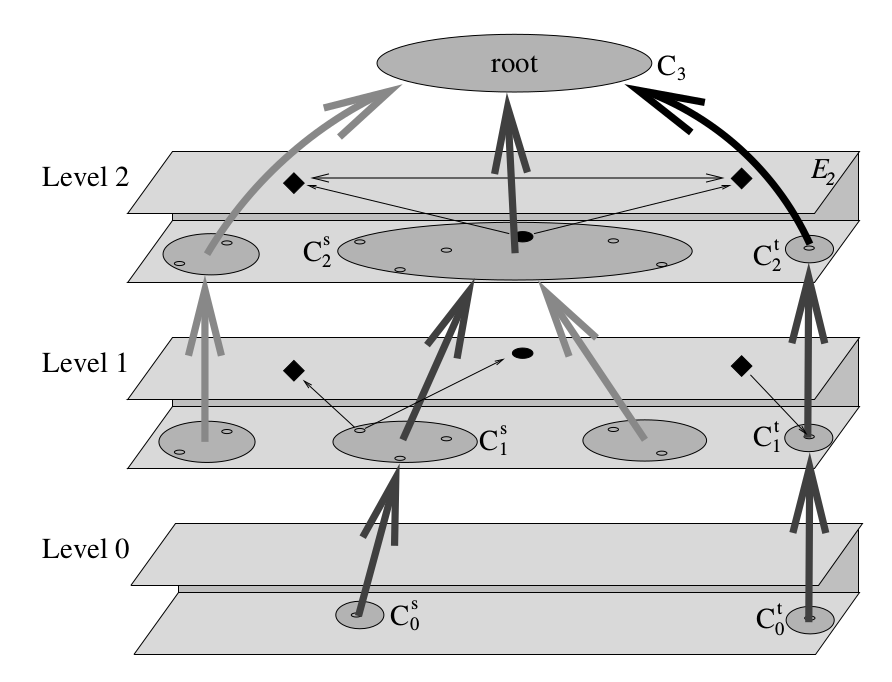
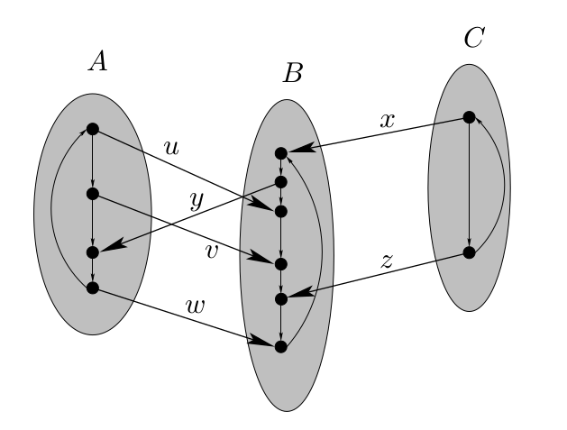
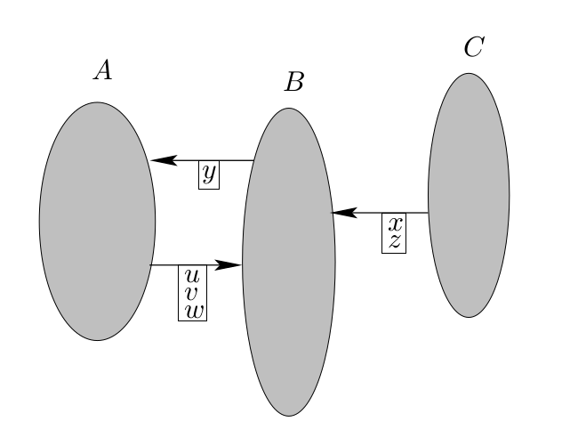

## Introduction

<!-- spiegare perché l'algoritmo sul grafo di base non è efficiente -->

The **multi-level graph structure** is a *hierarchical decomposition* tecnique which allows to speed-up shortest path problems on very big graphs. 

The idea of this algorithm is to create a *shortest-path distance preserving* graph smaller than the original one, on which one can efficiently solve computationally expensive problems.

 

After a formal description of the method, we'll look at the improvements in the   performance of *Dijkstra's algorithm* applied to **railway timetable information graphs**.

## Multi-level Graphs {.build}

Let $G = (V,E)$ be a weighted directed graph with non-negative weights. 

We want to extend both the number of edges and the number of *levels* of this graph, is such a way that **single-pair shortest path** algorithms can be applied efficiently on a smaller subgraph.

 

We start from a nested sequence of subsets of nodes
$$
V \supset S_1 \supset \dots \supset S_l
$$
which will be used to define the associated **multi-level graph** $\mathcal{M}(G;S_1,\dots,S_l)$ and its $l+1$ levels.

## Multi-level Graphs | Levels {.build}

Each level is a graph contaning all the nodes from $S_i$ and three possible kinds of edges:

- *level edges* $E_i\subseteq S_i \times S_i$;
- *upward edges* $U_i \subseteq (S_{i-1}\setminus S_i) \times S_i$;
- *downward edges* $D_i \subseteq S_i \times (S_{i-1}\setminus S_i)$.

 

The **i-th level** of $\mathcal{M}(G;S_1,\dots,S_l)$ is defined as the triple $L_i := (E_i, U_i, D_i)$.

Level $0$ is set to $L_0 := (E, \emptyset, \emptyset)$. 

<!-- briefly comment the image and describe the levels and the edges... -->

## Multi-level Graphs | Construction {.build}

The costruction of the levels is iterative:

<!-- , after building level $L_{i-1}$,  -->
- At the *i-th step* for each node $u\in S_{i-1}$ consider a shortest-path tree $T_u$ in the graph $(S_{i-1},E_{i-1})$.
 
- Level, upward and downward edges in the new level $L_i$ are chosen with the following condition:

Edge $(u,v)$ belongs to $L_i$ if and only if no internal   vertex of the shortest path $u-v$ in $L_u$ belongs to $S_i$. 

<!-- this means that the only edges of S_i occurring in the shortest path are u and v. -->

Notice that, since the shortest paths are not generally unique, this construction is not uniquely determined.

Now we define the multi-level graph
$$
\mathcal{M}(G;S_1,\dots,S_l) := \Big(V, E \cup \bigcup_{i=1,\dots,l}(E_i \cup U_i \cup D_i) \Big).
$$

## Multi-level Graphs | Connected components {.build}

Let's now consider the subgraphs of $G$ induced by the nodes in $V\setminus S_i$.

 

We'll use the following notation for each subgraph:

- $\mathcal{C}_i$ is the set of its connected components;
- $C_i^v$ is the connected component in $\mathcal{C}_i$ containing $v\in V\setminus S_i$;
- $v\in S_i$ is said to be *adjacent* to a component $C\in\mathcal{C}_i$ if there is at least one edge connecting them. 

## Multi-level Graphs | Connected components 

Let's now consider the subgraphs of $G$ induced by the nodes in $V\setminus S_i$.

 

<!-- In this framework, e -->
Edges $E_i$ represent the shortest paths *between vertices of $S_i$ passing through a connected component*.

Edges $U_i$ represent the shortest paths *from a vertex inside a connected component to all vertices of $S_i$ adjacent to that component*. 

Edges $D_i$ represent the shortest paths *from the adjacent vertices of a component to a vertex of that component*.

## Multi-level Graphs | Component Tree

 

Now we define the structure in which we are going to search for the shortest-distance preserving paths between nodes of $G$, the so called **component tree**:

- *Nodes* are made by the components in $\mathcal{C}_1\cup\dots\cup\mathcal{C}_l$, a root $C_{l+1}$ and a leaf $C_0^v$ for each node $v\in V$;
- *Edges* are built as follows:
    - the parent of a leaf $C_0^v$ is $C_{l+1}$ if the largest index such as $v\in S_i$ is $i=l$, and $C_{i+1}^v\in \mathcal{C}_{i+1}$ otherwise;
    - the parent of any other component $C_i\in \mathcal{C}_i$ is the component $C_{i+1}\in\mathcal{C}_{i+1}$ such that $V(C_i)\subseteq V(C_{i+1})$.
    

    
## Multi-level Graphs | Component Tree
    
Given two nodes $s,v\in V$, we define the subgraph $\mathcal{M}_{st}\subseteq\mathcal{M}$ induced by the edge set
$$
\begin{align}
E_{st} := E_{L-1} 
&\cup \bigcup_{i=k,\dots,L-1} \{(u,v)\in U_i | u \in Adj(C_{i-1}^s), v\in Adj(C_i^s) \\
&\cup \bigcup_{i=k',\dots,L-1} \{(u,v)\in D_i | u \in Adj(C_{i}^t), v\in Adj(C_{i-1}^t)
\}
\end{align}
$$
<!-- level L-1 edges + upw edges from s + dwd edges to t  -->
where $L$ is the smallest index such that $C_L^s=C_L^t$.<!-- smallest common ancestor of the leaves-->
<!-- k and k' are the levels of the parents of the leaves -->

 

**Lemma.** The length of the shortest s-t path is the same in the graphs $G$ and $\mathcal{M}_{st}$.

## Graph representation of Timetable Information | Adapting the Multi-level Graph approach {.build}

<!-- Now we want to apply the method just described to timetable information systems. In order to do that we need to give some slightly different definitions. -->

Our goal is to provide a train connection with **earliest arrival time**.

We assume that the timetable is periodic with period of one day and reduce the problem to a graph *shortest-path* problem.

## Graph representation of Timetable Information | Adapting the Multi-level Graph approach {.build}

 

A **Train Graph ($TG$)** contains a vertex for every arrival and departure time and two possible edges:

- *stay edges*, inside a single station, are ordered according to arrival and departure in the time period and weighted with the duration of the stay;
- *travel edges*, between different stations, are also connected according to timing, but weighted with the duration of the travel.

Notice that the problem inside this graph is reduced to a **single-source some-target** shortest path problem, due to the set of vertices belonging to a single station. 

## Graph representation of Timetable Information | Adapting the Multi-level Graph approach {.build}

We need an additional structure.

 

A **Station Graph ($SG$)** contains a vertex for each station and is unweighted.

Two stations are connected if and only if there is at least a travel edge between them in the train graph.

## Graph representation of Timetable Information | Adapting the Multi-level Graph approach {.build}

Now we need to define a modified version of the multi-level graph $\mathcal{M}(TG)$.

- There are two *nested sequences of sets*: 
    - $l$ sets of stations $V(SG) \supset \Sigma_1 \supset \dots \supset \Sigma_l$;
    - $l$ sets of timing nodes $V(TG) \supset S_1 \supset \dots \supset S_l$.
- The *component tree* is computed only inside the station graph.
    - The is one leaf $C^R$ for each station $R$;
    - $Adj(C^R) = T(R)$ is the set of all arrivals and departures belonging to the station $R$.
- A vertex $v\in TG$ is said to be *adjacent* to a component $C$ of $SG$ if $v$ and $C$ are connected by at least one edge in the station graph.

 

**Proposition. ** For each departure node $v$ in $TG$ belonging to the station $s$ in $SG$, the shortest-path from $v$ to one of the nodes in $s$ is the same in the graphs $TG$ and $\mathcal{M}_{st}(TG)$.

<!-- This means that in order to solve our problem it is sufficient to compute the shortest path problem inside $\mathcal{M}_{st}(TG)$. -->

## Experiments

## Experiments | Two levels

## Experiments | Multiple levels

## Conclusions

# Thank you.
