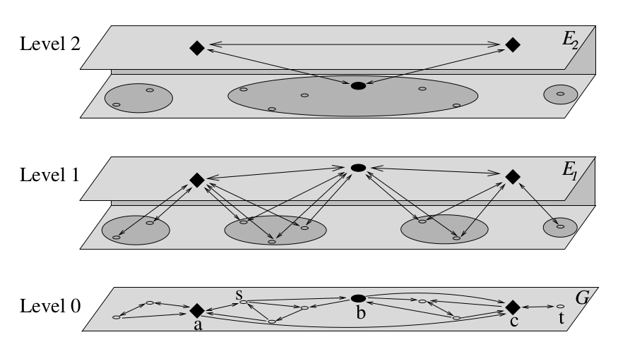

## Introduction

<!-- spiegare perché l'algoritmo sul grafo di base non è efficiente -->

## Multi-level Graph {.build}

Let $G = (V,E)$ be a weighted directed graph with non-negative weights. 

The idea is to extend both the number of edges and the number of *levels* of this graph, is such a way that **single-pair shortest path** algorithms can be applied efficiently on a smaller subgraph.

 

We start from a nested sequence of subsets of nodes
$$
V \supset S_1 \supset \dots \supset S_l
$$
which will be used to define the associated **multi-level graph** $\mathcal{M}(G;S_1,\dots,S_l)$ and its $l+1$ levels.

## Multi-level Graph | Levels {.build}

Each level is a graph contaning all the nodes from $S_i$ and three possible kinds of edges:

- *level edges* $E_i\subseteq S_i \times S_i$;
- *upward edges* $U_i \subseteq (S_{i-1}\setminus S_i) \times S_i$;
- *downward edges* $D_i \subseteq S_i \times (S_{i-1}\setminus S_i)$.

 

The **i-th level** of $\mathcal{M}(G;S_1,\dots,S_l)$ is defined as the triple $L_i := (E_i, U_i, D_i)$.

Level $0$ is set to $L_0 := (E, \emptyset, \emptyset)$. 

<!-- briefly comment the image and describe the levels and the edges... -->

## Multi-level Graph | Construction {.build}

The costruction of the levels is iterative:

<!-- , after building level $L_{i-1}$,  -->
- At the *i-th step* for each node $u\in S_{i-1}$ consider a shortest-path tree $T_u$ in the graph $(S_{i-1},E_{i-1})$.
 
- Level, upward and downward edges in the new level $L_i$ are chosen with the following condition:

Edge $(u,v)$ belongs to $L_i$ if and only if no internal   vertex of the shortest path $u-v$ in $L_u$ belongs to $S_i$. 

<!-- this means that the only edges of S_i occurring in the shortest path are u and v. -->

Notice that, since the shortest paths are not generally unique, this construction is not uniquely determined.

Now we define the multi-level graph 
$$
\mathcal{M}(G;S_1,\dots,S_l) := \Big(V, E \cup \bigcup_{i=1,\dots,l}(E_i \cup U_i \cup D_i) \Big).
$$

## Multi-level Graph | Component Tree

## Graph representation of Timetable Information | Adapting the Multi-level Graph approach

## Experiments

## Experiments | Two levels

## Experiments | Multiple levels

## Conclusions

# Thank you.
